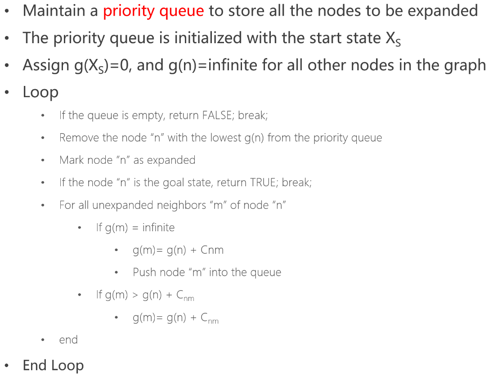
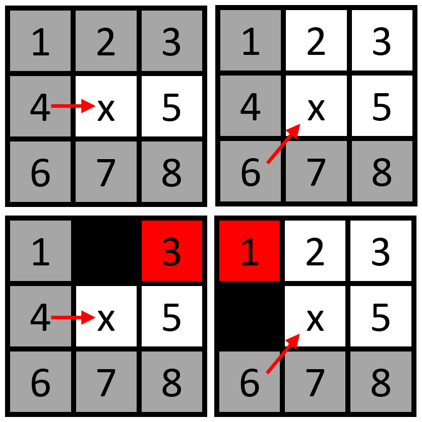
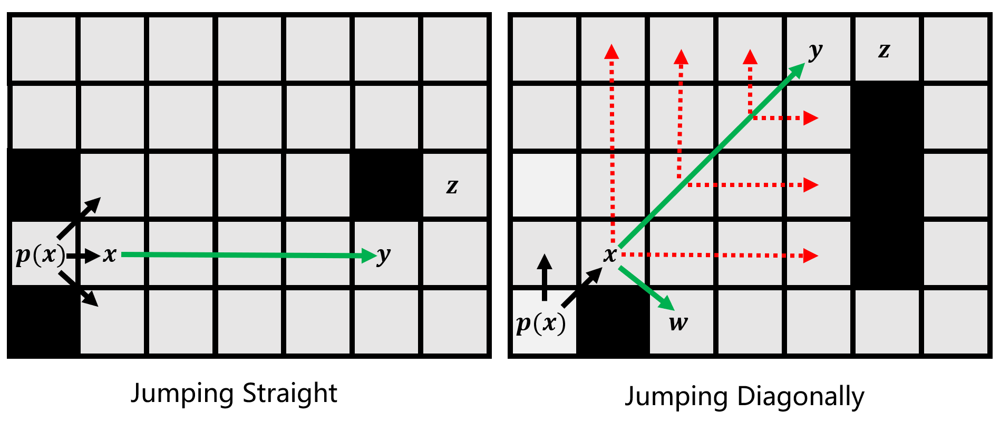
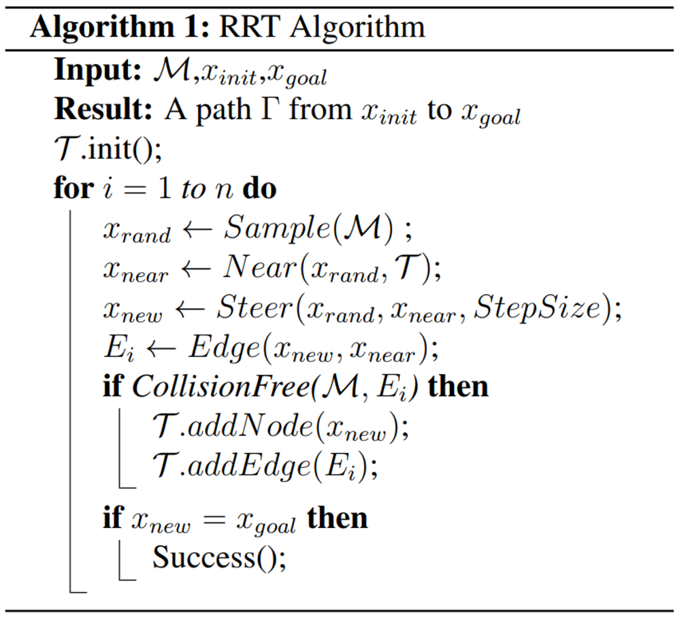
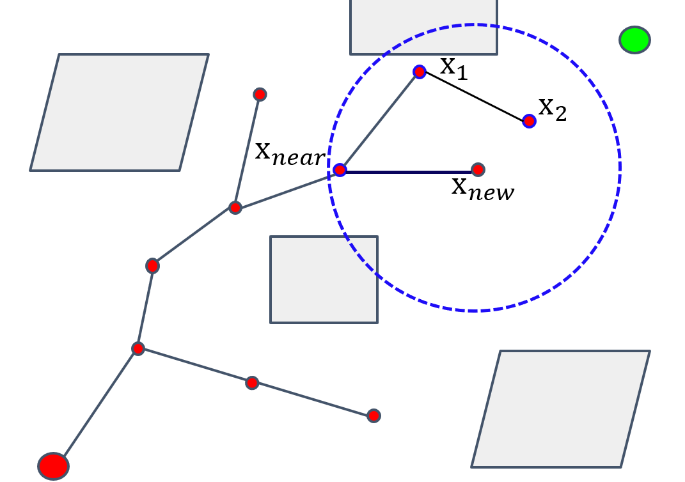
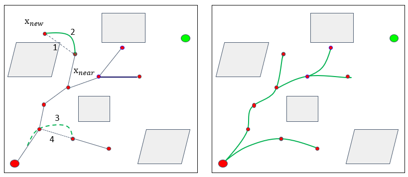
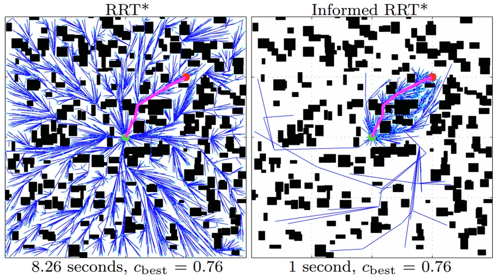
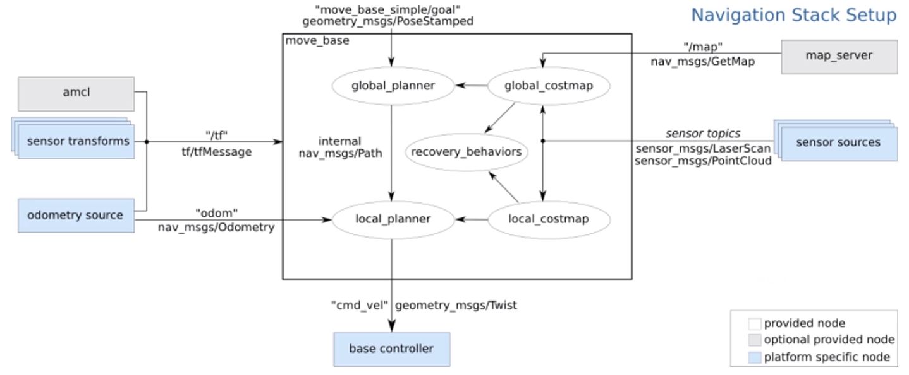
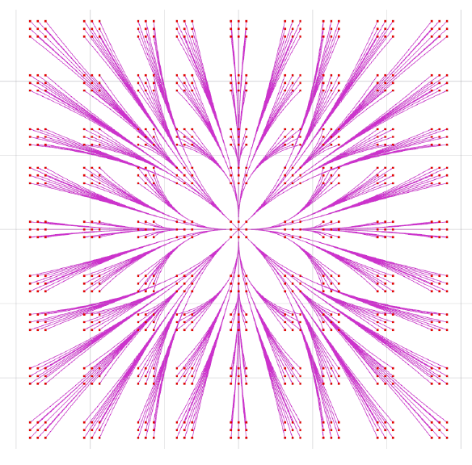
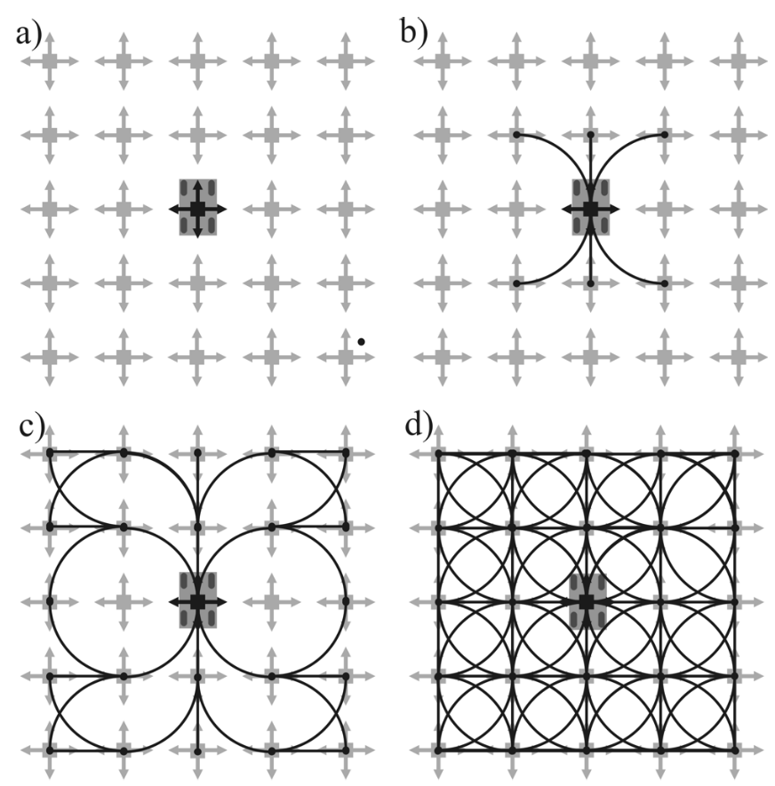

# Motion Planning

## 1. Overview

### 1.1 Front-end: Path Finding

- Search-based methods

  - General graph search: DFS，BFS
  - Djikstra and A\* search
  - Jump point search

- Sampling-based methods
  - Probabilistic roadmap (PRM)
  - Rapidly exploring random tree (RRT)
  - RRT* and informed RRT*

### 1.2 Kinodynamic Path Finding

- State Lattice Search

- Hybrid A\*

- Kinodynamic RRT\*

### 1.3 Back-end: Trajectory Optimization

- Basic Minimum-snap
- Hard constrained Minimum-snap
- Soft constrained Minimum-snap

### 1.4 Map Representation

- [Occupancy grid map](https://github.com/ANYbotics/grid_map)
- [Octo-map](https://octomap.github.io/)
- [Voxel hashing](https://github.com/niessner/VoxelHashing)
- Point cloud map: [PCL](http://pointclouds.org/)
- TSDF map: [OpenChisel](https://github.com/personalrobotics/OpenChisel)
- ESDF map: [VoxBlox](https://github.com/ethz-asl/voxblox), [FIESTA](https://github.com/HKUST-Aerial-Robotics/FIESTA), [TRR’s Local Map](https://github.com/HKUST-Aerial-Robotics/Teach-Repeat-Replan)

## 2. Search-based Path Finding

### 2.1 Graph Search Basis

Configuration Space

- **Robot configuration:** a specification of the positions of all points of the robot

- **Robot degree of freedom (DOF):** The minimum number 𝑛 of real-valued coordinates needed to represent the robot configuration

- **Robot configuration space:** a 𝑛-dim space containing all possible robot configurations, denoted as **C-space**

- Each robot pose is a **point** in the C-space

- In workspace, robot has space and size

  But in configuration space, robot is just a point.

- Planning made in configuration space, not in real world workspace.

### 2.2 Graph and Search Method

- Graph

  - Graphs have nodes and edges
  - Edges can be directed or undirected
  - Edges can also have weighted

- Graph Search

  - For every search problem, there is a corresponding state space graph

  - Work Flow

    Maintain a **container** to store all the nodes to be visited

    The container is initialized with the start state X~S~

    Loop

    ​ **Remove** a node from the container according to some pre-defined score function

    ​ **Expansion**: Obtain all neighbors of the node

    ​ **Push** them (neighbors) into the container

    End Loop

  - End the loop when the container is empty

  - Another container for the nodes which has been visited

  - What is the score function

- Breadth First Search (BFS) && Depth First Search (DFS)

  - BFS (container queue): first in first out
  - DFS (container stack): last in first out

- Heuristic search

  Greedy Best First Search

  - Definition: A heuristic is a guess of how close you are to the target
  - Example: Euclidean Distance or Manhattan Distance

### 2.3 Dijkstra and A\*

- Dijkstra: push the minimum value node of cost function $g(x)$.

  

- A\*: Dijkstra with a Heuristic $f(n)=g(n)+ε×h(n)$

  - Only the cost function is different.
  - **Admissible** Heuristics is important.
  - $h(n)≤h^*(n)$ is admissible. $h^*(n)$ is real, $h(n)$ is estimate

- Engineering Considerations

  - Grid-based Path Search: 4 or 8 connection

  - Priority queue in C++

    - std::priority_queue
    - std::make_heap
    - std::multimap

  - $h(n)<h^*(n)$ and $h(n) ≈ h^*(n)$ is best, which is tight

    - Example: in 8 connection of 2D space

      $dx = abs(node.x - goal.x)$
      $dy = abs(node.y - goal.y)$
      $h  = (dx + dy) + (sqrt(2)-2)*min(dx,dy)$

  - **Tie Breaker**

    - break the equal.

    - let the equal value have difference

    - if two node have equal f, then let the h have some different

    - $h=h×(1+p)$

      $p < ($$minimum$ $cost$ $of$ $one$ $step)/(expected$ $maximum$ $path$ $cost)$

### 2.4 Jump Point Search

- Look ahead Rule

  > if the neighbor can be reached from father node with smaller or equal cost, then the neighbor doesn't need to be reached from son node.

  

  So in the image, only white node should be considered in the search flow.

- Jumping Rule

  

  one jump, only the node who can find force neighbor in his jumping can be added into the open list. By the mean, the special nodes are all nodes in eight directions.

- Work Flow: same as A\*

  A\* find the "geometric" neighbors, while JPS find its "jumping" neighbors

- More Information of 3D JPS: [Planning Dynamically Feasible Trajectories for Quadrotors using Safe Flight Corridors in 3-D Complex Environments, Sikang Liu, RAL 2017](https://github.com/KumarRobotics/jps3d)

## 3. Sampling-based Path Finding

### 3.0 Notion of Completeness in Planning

- Complete Planner: always answers a path planning query correctly in bounded time
- Probabilistic Complete Planner: if a solution exists, planner will eventually find it, using random sampling. (e.g. Monte Carlo sampling)
- Resolution Complete Planner: same as above but based on a deterministic sampling. (e.g. sampling on a fixed grid)

### 3.1 Probabilistic Road Map

- About PRM: a graph structure
  - Learning phase
    - Sample N point in C-space
    - Delete points that are not collision-free
    - Connect to nearest points and get collision-free segments
    - Delete segments that are not collision free
  - Query phase
    - Search on the road map to find a path from the start to the goal (using Dijkstra algorithm or A\* algorithm)
    - Road map is now similar with the grid map (or a simplified grid map)
- Improving efficiency: lazy collision-checking
  - Sample points and generate segments without considering the collision
  - Find the path, and delete the corresponding edges and nodes if the path is not collision free. Restart path finding
  - Only the node in the path will be checked with collision

### 3.2 Rapidly-exploring Random Tree

- Overview
  - Different in the connections about the tree.
  - RRT like a tree with random growing edges.

- Improving efficiency

  - Change sampling methods, let point sampled in the empty area
  - KD-Tree: a effective date structure to search the nearest point

  

  - Bidirectional RRT / RRT Connect
    - grow a tree from both the start point and the goal point
    - path finding when two trees are connected

### 3.3 Optimal sampling-based path planning methods

- RRT\*

  

  - Find the minimum cost from start to current node as the father node, not the nearest node.
  - while find the path, it won't stop.

- Kinodynamic-RRT\*

  

  - change steer function to fit with motion or other constraints in robot navigation

- Anytime-RRT\*

  - keep optimizing the leaf RRT tree when the robot executes the current trajectory Anytime Fashion

### 3.4 Advanced path planning methods

- [Informed RRT\*](https://ieeexplore.ieee.org/document/6942976)

  

- [Cross-entropy motion planning](http://www.roboticsproceedings.org/rss07/p22.pdf)

- [Lower Bound Tree RRT (LBTRRT)](https://arxiv.org/pdf/1308.0189.pdf)

- [Sparse Stable RRT](http://pracsyslab.org/sst_software)

- [Transition-based RRT (T-RRT)](http://homepages.laas.fr/jcortes/Papers/jaillet_aaaiWS08.pdf)

- [Vector Field RRT](https://ieeexplore.ieee.org/stamp/stamp.jsp?tp=&arnumber=6606360)

- [Parallel RRT (pRRT)](https://robotics.cs.unc.edu/publications/Ichnowski2012_IROS.pdf)

- [More of RRT](https://github.com/zychaoqun)

### 3.5 Implementation

- A lib for mechanical arm

  - [Open Motion Planning Library](https://ompl.kavrakilab.org/)
  - [Moveit with ROS](https://moveit.ros.org/)
  - [Tutorials](https://industrial-training-master.readthedocs.io/en/melodic/_source/session4/Motion-Planning-CPP.html)

- [Navigation stick - ROS](http://wiki.ros.org/move_base)

  

  - Global planner: A*,D*, RRTs, etc
  - Local planner: Dwa,eband, Teb, etc

## 4. Kinodynamic path finding

Kinodynamic = Kinematic + Dynamic

- Kinematic: avoid obstacles
- Dynamic: bounds on velocity, acceleration and force

### State Lattice Planning

Require a graph with feasible motion connections.
Basic motivation of kinodynamic path finding:

- Forward direction: discrete (sample) in **control** space -> Search-based
- Reverse direction: discrete (sample) in **state** space -> Sampling-based

#### sampling in control space

- forward simulation
- fixed in math
- no mission guidance
- easy to implement
- low planning efficiency

For example: each state can grow up into nine substates with different input, which can become a tree.

#### sampling in state space

- backward calculation
- need calculate
- good mission guidance
- hard to implement
- high planning efficiency

the lattice graph can be build in four step:

1. Given a origin.
2. For 8 neighbor nodes around the origin, feasible path are found.
3. Extend outward to 24 neighbors.
4. Complete lattice.

### Optimal Boundary Value Problem

BVP: Boundary Value Problem

this is a basic BVP, but it has many solution, which is the best?

OBVP: Optimal Boundary Value Problem

### Hybrid A\*

Reveiw

- Online generate a dense lattice costs too much time
- Each path generate form sime state might get together easily
- grid map search is not kinodynamic for a robot

So here is **hybrid A\***:Integral by using sampling in control space, but only keep one state in each grid.

Heuristic design

- 2D-Euclidean distance: direct but not tight **(a)**
- non-holonomic-without-obstacles: better in empty environment **(b)**, bad performance in dead ends **(c)**
- non-holonomic-without-obstacles + holonomic-with-obstacles **(d)** (for example: max in both or give wight)

Other tricks:

- One shot heuristic: add a state-driven bias towards the searching process.

### Kinodynamic RRT\*

Find neighbors with the OBVP.

Choose the effective neighbors by minimize the control cost.

## 5. Minimum snap trajectory generation

Smooth trajectory is better than planning path.

### Differential Flatness

The states and the inputs of a quadrotor can be written as algebraic functions of four carefully selected flat outputs and their derivatives.

### Minimum snap Optimization

| Derivative | Translation  |       Rotation       |       Thrust        |
| :--------: | :----------: | :------------------: | :-----------------: |
|     0      |   Position   |                      |                     |
|     1      |   Velocity   |                      |                     |
|     2      | Acceleration |       Rotation       |                     |
|     3      |     Jerk     |   Angular Velocity   |       Thrust        |
|     4      |     Snap     | Angular Acceleration | Differential thrust |

- Minimum jerk: minimum angular velocity, good for visual tracking
- Minimum snap: mimimum differential thurst, save energy

**For the minimum snap (jerk) trajectory generation**

- Each segment is a polynomial
- No need to fix order, but keep the same order to make problem sampler
- Time durations for each segment must be known

**For the traj order**

- Ensure smoothness at an order
- Ensure continuity at an order
- Minimize control input at an order

This three items are not coupled

Generally:

- Minimum jerk: N = 2\*3(jerk)-1 = 5
- Minimum snap: N = 2\*4(snap)-1 = 7

Start point and end point can provide more boundary conditions.
More segments of trajectory, less boundary conditions the middle point need to provide.

**Different timeline**

- One common timeline, mathematical clear, but hard to evaluate
- Many relative timeline, numerial stable

**Disciplined convex optimization programs**

* LP: Linear programmming
* QP: Quadratic programming
* QCQP: Quadratically constrained QP
* SOCP: Second-order cone programming
* SDP: Semidefinite programmming

### Closed-form solution of minimum snap

### Implementation details

1. Convex Solvers
   - [CVX](http://cvxr.com/cvx/): MATLAB warpper. Let you write down the convex problem like mathematical equations, then call other solvers to solve the problem.
   - [Mosek](https://www.mosek.com/): Very robust convex solvers, can solve almost all kinds of convex programs. Can apply free academic license. Only library available (x86).
   - [OOQP](http://pages.cs.wisc.edu/~swright/ooqp/): Very fast, robust QP solver. Open sourced.
   - [GLPK](https://www.gnu.org/software/glpk): Very fast, robust LP solver. Open sourced.
2. Numerical Stability

