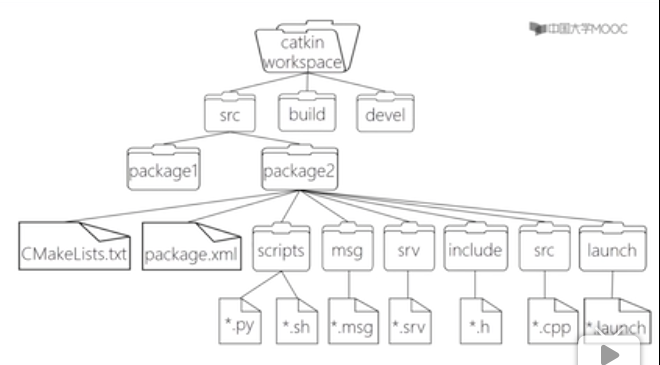

# ROS 操作系统

## 零、文件系统



### Catkin 编译系统

- 以 package 为单元编译
- 需要在 workspace 目录下编译，目录下需要有 src 文件：`$catkin_make`
- 编译之后需要手动 source 一下环境
- `$source YOUPATH/catkin_ws/devel/setup.bashrc`
- `$echo “source YOUPATH/catkin_ws/devel/setup.bashrc” >> ./bashrc`

### Package 文件

- 包括 package.xml 与 Cmakelists.txt

- 创建package：`$catkin_create_pkg <package_name> [depend1] [depend2] ...`

  如：`$catkin_create_pkg test_pkg roscpp rospy std_msgs`

- 常用package命令行指令：

  - `rospack help`
  - `rospack list`：列出所有 package，需要有 source
  - `rospack depends [package]`：显示 package 的依赖包
  - `rospack find [package]`：定位某个 package
  - `rospack prifile`：刷新所有 package 的位置记录
  - `roscd [package]`：cd 到 package 的所在路径
  - `rosls [package]`：列出 package 下的文件

- `rosdep` 是一个能够下载并安装ROS packages所需要的系统依赖项的小工具

  - `rosdep check [package]`：检查 package 的依赖是否满足
  - `rosdep install [package]`：安装 package 的依赖项
  - `rosdep db`：生成和显示依赖的数据库
  - `rsodep init`：初始化/etc/ros/rosdep 中的源
  - `rosdep keys [package]`：列出 package 所需要的所有公钥
  - `rosdep update`：更新本地的 rosdep 数据库
  - `rosdep install --from-paths src --ignore-src --rosdistro=kinetic -y`，用于安装工作空间中 src 路径下所有 package 的依赖项（由 pacakge.xml 文件指定）


## 一、通信架构

### Master

- 管理节点，实现节点之间的点对点通信
- node 启动时需要向 master 注册
- `$roscore`：启动 master，rosout（日志输出 Node），和 parameter server（参数服务器）

### Node

- ROS 进程，pkg 中的可执行文件运行的实例

- 常用node的命令行指令：

  - `$rosrun [pkg_name] [node_name]`
  - `$rosnode list`
  - `$rosnode info [node_name]`
  - `$rosnode kill [node_name]`
  - `$rosnode ping`
  - `$rosnode cleanup`：清除不可到达的节点的注册信息

- 如何构建节点（C++）

  - 比如以下代码：

    ```cmake
    add_library( minsnapCloseform
      include/min_snap/min_snap_closeform.h
      src/min_snap_closeform.cpp
    ) # class
    target_link_libraries(minsnapCloseform ${catkin_LIBRARIES})
    
    add_dependencies(listener beginner_tutorials_generate_messages_cpp)
    
    add_executable(min_snap_generator src/min_snap_generator.cpp)
    target_link_libraries(min_snap_generator minsnapCloseform ${catkin_LIBRARIES})
    ```

  - 其中`add_dependences()是将可执行目标添加依赖项`。

  - 在新版中，还可以使用`target_link_libraries()`来依赖所有必须的目标。


### Launch

- 一次性启动多个 Node

- launch 文件遵循着 xml 格式规范，是一种标签文本，它的格式包括以下标签：

  ```xml
  <launch> 		<!--根标签-->
  <node> 			<!--需要启动的node及其参数-->
  <include> 		<!--包含其他launch-->
  <machine> 		<!--指定运行的机器-->
  <env-loader> 	<!--设置环境变量-->
  <param> 		<!--定义参数到参数服务器-->
  <rosparam> 		<!--启动yaml文件参数到参数服务器-->
  <arg> 			<!--定义变量-->
  <remap> 		<!--设定参数映射-->
  <group> 		<!--设定命名空间-->
  </launch> 		<!--根标签-->
  ```

- `$roslaunch [pkg_name] [file_name.launch]`：自动启动 master（如果没启动）和多个节点

### Topic

- ROS 中的异步通信，采用 publish 和 subscribe 通信，类似与公告板
- 一个 Topic 可以有多个 Subscriber，可以有多个 Publisher 发布同一个 Topic
- 常用topic命令行指令
  - `$rostopic list`
  - `$rostopic info /topic_name`
  - `$rostopic echo /topic_name`：显示某个 Topic 的内容
  - `$rostopic pub -1 /topic_name …`
  - `rostopic hz topic_nale`
  - `$rostopic type /topic_name`：显示某个 Topic 的类型


### Message

- Topic 内容的数据类型定义在.msg 中，是 Class，是 Struct

- `$rosmsg list`

- `$rosmsg show /msg_name`

- 常用 msg 合集，请见下文

- 创建Message的方法：

  - 在`package.xml`中，应该具有以下两行内容：

    ```html
    <build_depend>message_generation</build_depend>
    <exec_depend>message_runtime</exec_depend>
    ```

    注意，在构建时，其实只需要`message_generation`，而在运行时，我们只需要`message_runtime`。

  - 在`CMakeLists.txt`中

    - 需要将`message_generation`添加到`find_package`的`COMPONENTS`列表中
    - 还需要确保导出消息的运行时依赖关系：`catkin_package(... CATKIN_DEPENDS message_runtime ...)`。
    - 最后取消注释：`add_message_files(FILES message.msg)`，添加自己的message文件名

  - 你可能注意到了，有时即使没有使用全部依赖项调用find_package，项目也可以构建。这是因为catkin把你所有的项目整合在了一起，因此如果之前的项目调用了find_package，你的依赖关系也被配置成了一样的值。但是，忘记调用意味着你的项目在单独构建时很容易崩溃。


### Service

- 同步通信方式，通过 request 和 reply 方式通信，多对一，类似与服务器和用户

- 一个是 Server，一个是 Client，C 发送请求之后会等待 S 回复，之后才会继续

- 可以理解为从其他 Node 调用函数

- 通信**格式**为.srv

- srv文件包含两个部分，请求和响应，这两部分用一条线`---`隔开

- srv 只能嵌套 msg，不能嵌套 srv

- 常用命令行指令：

  - `$rosservice list`
  - `$rosservice info service_name`
  - `$rosservice call service_name args`：args 为传入参数
  - `$rossrv list`
  - `$rossrv show srv_name`

- 创建srv的方法：

  - 在`package.xml`中应该有如下两行内容：

    ```html
    <build_depend>message_generation</build_depend>
    <exec_depend>message_runtime</exec_depend>
    ```

    如前所述，在构建时，其实只需要`message_generation`，而在运行时，我们只需要`message_runtime`。

  - 同样要在`CMakeList.txt`里面增加`message_generation`

  - 同样要取消注释：`add_service_files(FILES service.srv)`，添加自己的service文件名


### Parameter Server

- 可以理解为全局 define，是存储各种参数的字典
- 可以通过命令行，launch 文件和 API 中维护
- `$rosparam list`：列出当前所有参数
- `$rosparam get param_key`：显示某个参数的值
- `$rosparam set param_key param_value`：设置某个参数的值
- `$rosparam dump file_name`：保存参数到文件
- `$rosparam load file_name`：从文件读取参数，需要遵从 YAML 格式
- `$rosparam delete param_key`：删除参数

### Action

- 有状态反馈，常常在长时间，可抢占（被打断）的任务中
- 通信数据格式为.antion
- .action 分为三部分，goal，result，feedback

## 二、常用工具

### Gazebo

- 可视化图形工具，作为主要的仿真环境
- 可以在上面进行各种物理模型等的仿真

### rviz

- 接收 Topic 用 3D 可视化呈现出来

### rqt

- rqt_graph:显示通信架构
- rqt_plot :绘制曲线
- rqt_console :查看日志

### rosbag

- 将 Topic 数据记录到.bag 中，可以回放
- `$rosbag record -0 bagname topic_names`：记录某些 Topic 到 指定名称的bag 中
- `$rosbag record -a`：记录所有 Topic 到 bag 中
- `$rosbag play bag_file`：回放 bag
  - `$rosbag play -r rate <bagefile>`：按照倍速进行播放


### roswtf

* `roswtf`可以检查你的系统中某个包并尝试发现问题，这适用于没有开启roscore的情况
* 当`roscore`开启之后，`roswtf`可以检查一些ros图的在线检查和运行时的检查，检查时间长短取决于正在运行的ROs节点数量
* `roswtf`会对一些系统中看起来异常但可能是正常的运行情况发出警告。也会对确实有问题的情况报告错误。

## 三、常用 msg 结构合集

本小节主要介绍常见的 message 类型，包括 std_msgs, sensor_msgs, nav_msgs,geometry_msgs 等

### Vector3.msg

```
#文件位置:geometry_msgs/Vector3.msg

float64 x
float64 y
float64 z
```

### Accel.msg

```
#定义加速度项，包括线性加速度和角加速度
#文件位置:geometry_msgs/Accel.msg

Vector3 linear
Vector3 angular
```

### Header.msg

```
#定义数据的参考时间和参考坐标
#文件位置:std_msgs/Header.msg

uint32 seq #数据ID
time stamp #数据时间戳
string frame_id #数据的参考坐标系
```

### Echos.msg

```
#定义超声传感器
#文件位置:自定义msg文件

Header header
uint16 front_left
uint16 front_center
uint16 front_right
uint16 rear_left
uint16 rear_center
uint16 rear_right
```

### Quaternion.msg

```
#消息代表空间中旋转的四元数
#文件位置:geometry_msgs/Quaternion.msg

float64 x
float64 y
float64 z
float64 w
```

### Imu.msg

```
#消息包含了从惯性原件中得到的数据，加速度为m/^2，角速度为rad/s
#如果所有的测量协方差已知，则需要全部填充进来如果只知道方差，则
#只填充协方差矩阵的对角数据即可
#位置：sensor_msgs/Imu.msg

Header header
Quaternion orientation
float64[9] orientation_covariance
Vector3 angular_velocity
float64[9] angular_velocity_covariance
Vector3 linear_acceleration
float64[] linear_acceleration_covariance
```

### LaserScan.msg

```
#平面内的激光测距扫描数据，注意此消息类型仅仅适配激光测距设备
#如果有其他类型的测距设备(如声呐)，需要另外创建不同类型的消息
#位置：sensor_msgs/LaserScan.msg

Header header 			#时间戳为接收到第一束激光的时间
float32 angle_min 		#扫描开始时的角度(单位为rad)
float32 angle_max 		#扫描结束时的角度(单位为rad)
float32 angle_increment #两次测量之间的角度增量(单位为rad)
float32 time_increment 	#两次测量之间的时间增量(单位为s)
float32 scan_time 		#两次扫描之间的时间间隔(单位为s)
float32 range_min 		#距离最小值(m)
float32 range_max 		#距离最大值(m)
float32[] ranges 		#测距数据(m,如果数据不在最小数据和最大数据之间，则抛弃)
float32[] intensities 	#强度，具体单位由测量设备确定，如果仪器没有强度测量，则数组为空即可
```

### Point.msg

```
#空间中的点的位置
#文件位置:geometry_msgs/Point.msg

float64 x
float64 y
float64 z
```

### Pose.msg

```
#消息定义自由空间中的位姿信息，包括位置和指向信息
#文件位置:geometry_msgs/Pose.msg

Point position
Quaternion orientation
```

### PoseStamped.msg

```
#定义有时空基准的位姿
#文件位置：geometry_msgs/PoseStamped.msg

Header header
Pose pose
```

### PoseWithCovariance.msg

```
#表示空间中含有不确定性的位姿信息
#文件位置：geometry_msgs/PoseWithCovariance.msg

Pose pose
float64[36] covariance
```

### Power.msg

```
#表示电源状态，是否开启
#文件位置：自定义msg文件

Header header
bool power
######################
bool ON = 1
bool OFF = 0
```

### Twist.msg

```
#定义空间中物体运动的线速度和角速度
#文件位置：geometry_msgs/Twist.msg

Vector3 linear
Vector3 angular
```

### TwistWithCovariance.msg

```
#消息定义了包含不确定性的速度量，协方差矩阵按行分别表示：
#沿x方向速度的不确定性，沿y方向速度的不确定性，沿z方向速度的不确定性
#绕x转动角速度的不确定性，绕y轴转动的角速度的不确定性，绕z轴转动的
#角速度的不确定性
#文件位置：geometry_msgs/TwistWithCovariance.msg

Twist twist
float64[36] covariance #分别表示[x; y; z; Rx; Ry; Rz]
```

### Odometry.msg

```
#消息描述了自由空间中位置和速度的估计值
#文件位置：nav_msgs/Odometry.msg

Header header
string child_frame_id
PoseWithCovariance pose
TwistWithCovariance twist
```
