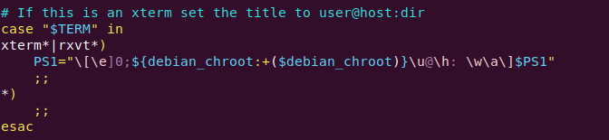

# Ubuntu20.04 重装系统后的软件安装指南

## 如何解决 Ubuntu20.04 与 Windows 系统时间不同步

```bash
timedatectl set-local-rtc true
```

## 常用国内源

对原来文件进行备份：

```bash
sudo cp /etc/apt/sources.list /etc/apt/sources.list.old
```

gedit 复制新的源文件

阿里云源

```bash
deb http://mirrors.aliyun.com/ubuntu/ focal main restricted universe multiverse
deb-src http://mirrors.aliyun.com/ubuntu/ focal main restricted universe multiverse
deb http://mirrors.aliyun.com/ubuntu/ focal-security main restricted universe multiverse
deb-src http://mirrors.aliyun.com/ubuntu/ focal-security main restricted universe multiverse
deb http://mirrors.aliyun.com/ubuntu/ focal-updates main restricted universe multiverse
deb-src http://mirrors.aliyun.com/ubuntu/ focal-updates main restricted universe multiverse
deb http://mirrors.aliyun.com/ubuntu/ focal-proposed main restricted universe multiverse
deb-src http://mirrors.aliyun.com/ubuntu/ focal-proposed main restricted universe multiverse
deb http://mirrors.aliyun.com/ubuntu/ focal-backports main restricted universe multiverse
deb-src http://mirrors.aliyun.com/ubuntu/ focal-backports main restricted universe multiverse
```

中科大源

```bash
deb https://mirrors.ustc.edu.cn/ubuntu/ focal main restricted universe multiverse
deb-src https://mirrors.ustc.edu.cn/ubuntu/ focal main restricted universe multiverse
deb https://mirrors.ustc.edu.cn/ubuntu/ focal-updates main restricted universe multiverse
deb-src https://mirrors.ustc.edu.cn/ubuntu/ focal-updates main restricted universe multiverse
deb https://mirrors.ustc.edu.cn/ubuntu/ focal-backports main restricted universe multiverse
deb-src https://mirrors.ustc.edu.cn/ubuntu/ focal-backports main restricted universe multiverse
deb https://mirrors.ustc.edu.cn/ubuntu/ focal-security main restricted universe multiverse
deb-src https://mirrors.ustc.edu.cn/ubuntu/ focal-security main restricted universe multiverse
deb https://mirrors.ustc.edu.cn/ubuntu/ focal-proposed main restricted universe multiverse
deb-src https://mirrors.ustc.edu.cn/ubuntu/ focal-proposed main restricted universe multiverse
```

## 中文输入法

按照 sougou for linux 的官方教程安装即可

## 更换 Terminal 为 zsh

终端采用 zsh 和 oh-my-zsh，美观且功能强大！！！ZSH, also called the Z shell

首先，安装 zsh：

```bash
sudo apt install zsh
```

将默认终端由 bash 换成 zsh（可选）

```bash
chsh -s /bin/zsh   #注意：不要使用sudo
```

安装 oh-my-zsh 项目来帮我们配置 zsh，采用 wget 安装：

```bash
cd ~/Downloads
wget https://gitee.com/mirrors/oh-my-zsh/raw/master/tools/install.sh
chmod +x install.sh
./install.sh
```

安装语法高亮插件和自动补全插件

```bash
git clone https://gitee.com/lxgyChen/zsh-syntax-highlighting.git ${ZSH_CUSTOM:-~/.oh-my-zsh/custom}/plugins/zsh-syntax-highlighting

git clone https://github.com/zsh-users/zsh-autosuggestions.git ${ZSH_CUSTOM:-~/.oh-my-zsh/custom}/plugins/zsh-autosuggestions
```

再将~/.zshrc 中的`plugins=(git)`改为`plugins=(git zsh-syntax-highlighting zsh-autosuggestions)`, 最后运行`source ~/.zshrc`

最后，如果需要使用 ros，同一般 bash 一样，需要在配置文件中增加一句话：

```bash
vim ~/.zshrc
source /opt/ros/noetic/setup.zsh
```

## terminator 样式配置

打开配置文件：

```bash
cd ~/.config/terminator/
sudo vim config
```

修改配置文件

```
[global_config]
  title_transmit_bg_color = "#204a87"
  title_receive_bg_color = "#ef2929"
  inactive_color_offset = 0.8041237113402062
  suppress_multiple_term_dialog = True
[keybindings]
[profiles]
  [[default]]
    background_color = "#320e2a"
    cursor_color = "#aaaaaa"
    font = Monospace 11
    foreground_color = "#ffffff"
    show_titlebar = False
    scrollbar_position = hidden
    scroll_on_keystroke = False
    scroll_on_output = True
    scrollback_lines = 5000
    palette = "#000000:#cc0000:#4e9a06:#c4a000:#3465a4:#75507b:#06989a:#d3d7cf:#555753:#ef2929:#8ae234:#fce94f:#729fcf:#ad7fa8:#34e2e2:#eeeeec"
    use_system_font = False
    copy_on_selection = True
    rewrap_on_resize = False
[layouts]
  [[default]]
    [[[window0]]]
      type = Window
      parent = ""
    [[[child1]]]
      type = Terminal
      parent = window0
      profile = default
[plugins]
```

最后需要在~/.bashrc 中修改用户名颜色



上图中，修改 PS1=....，可以更改颜色。将原来的可以屏蔽掉，添加自己的设置：

```bash
PS1="\[\e[01;32;36m\]\u\[\e[37;33m\]@\h: \[\e[36;32m\]\w\[\e[0m\]\\$ "
```
