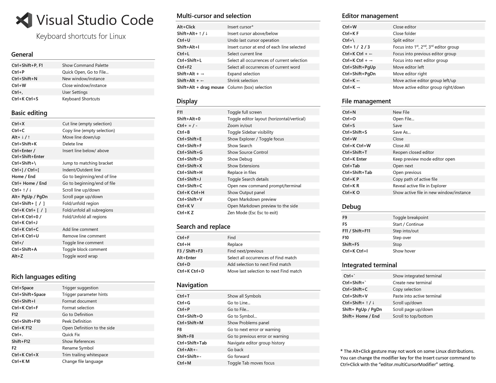
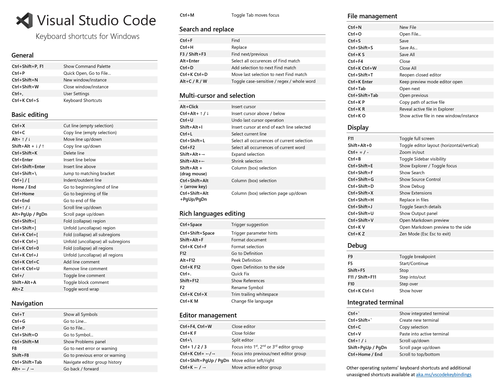

# VS code 使用教程

[Visual Studio Code 官方教程](https://code.visualstudio.com/docs)

## 快捷键

`Ctrl+Shift+G`：切换到 Git 分支管理

`Ctrl+Shift+I`：整个文档格式化

`Ctrl+Shift+M`：快速跳入项目中的错误和警告

`Ctrl+Shift+P` `F1`：命令面板

`Ctrl+Shift+V`：打开 Markdown 预览

`Ctrl+Shift+X`：扩展

`F8` `Shift+F8`：循环浏览错误

`Ctrl+B`：缩放侧边栏

`Ctrl+G`：导航到特定行

`Ctrl+J`：缩放下方面板

`Ctrl+L`：选择当前行

`Ctrl+P`：快速打开文件

`Ctrl+R`：快速切换工作区

`Ctrl+U`：撤销到上一个光标位置

`Ctrl+W`：关闭活动的编辑器

`Ctrl+,`：打开用户设置

`Ctrl+·`：综合终端

`Ctrl+\`：横排分屏编辑

`Ctrl+1`：切换编辑器组

`Ctrl+PageUp` `Ctrl+PageDown`：切换编辑器

`Alt+UP` `Alt+DOWN`：上下移动一整行

更多键盘快捷键的配置可以添加到`keybindings.json`文件中
更多用户设置可以添加到文件`settings.json`中
工作区特定文件位于根文件夹`.vscode`中。如`tasks.json`对应 Task Runner 、`launch.json`对应调试器。

- Linux 下更多快捷键

  

- Windows 下更多快捷键

  

## 技巧窍门

[More Tips](https://code.visualstudio.com/docs/getstarted/tips-and-tricks)

### 多光标选择

要在任意位置添加光标，请使用鼠标选择一个位置并使用 Alt+单击
要在当前位置上方或下方设置光标，请使用：
键盘快捷键：`Shift+Alt+Up`或`Shift+Alt+Down`

### 列（框）选择

可以在拖动鼠标时按住`Shift+Alt`来选择文本块。将在每个选定行的末尾添加一个单独的光标。

### 快速滚动

按`Alt`键可以在编辑器和资源管理器中快速滚动。默认情况下，快速滚动使用`5X`速度倍增器

### 转换文本命令

可以在命令面板中使用`transform`将选定文本转换为大写，小写或者标题大小写

### Git 分支管理

从源代码管理视图中，选择一个文件以打开差异
差异的默认视图是并排视图。
切换内嵌视图点击更多操作右上角（...）按钮，然后选择切换内联视图。
使用`F7`和`Shift+F7`浏览差异。这将以统一的补丁格式呈现它们。可以使用箭头键导航行，按`Enter`将跳回差异编辑器和所选行。
点击左下角状态栏在 Git 分支中间进行切换
在源代码管理中点击文件的加减号暂存或者取消暂存
点击`√`将暂存文件进行提交，点击`···`进行更多操作

## 编译 调试

以 C++为例，首先需要有源代码文件，比如`helloworld.cpp`

```c++
#include <iostream>
#include <vector>
#include <string>

using namespace std;

int main()
{
    vector<string> msg {"Hello", "C++", "World", "from", "VS Code", "and the C++ extension!"};

    for (const string& word : msg)
    {
        cout << word << " ";
    }
    cout << endl;
}
```

### 编译

在任务栏窗口输入`Tasks: Configure Default Build Task`可以配置默认构建任务，在其中可以选择对应的编译器（之后也可以修改），这将会创建一个`.vscode/tasks.json`脚本文件

```json
{
  "version": "2.0.0",
  "tasks": [
    {
      "type": "cppbuild",
      "label": "C/C++: g++ 生成活动文件",
      "command": "/usr/bin/g++",
      "args": [
        "-g",
        "${file}",
        "-o",
        "${fileDirname}/${fileBasenameNoExtension}"
      ],
      "options": {
        "cwd": "${fileDirname}"
      },
      "problemMatcher": ["$gcc"],
      "group": {
        "kind": "build",
        "isDefault": true
      },
      "detail": "编译器: /usr/bin/g++"
    }
  ]
}
```

- `command`设置指定要运行的程序；在上述文本中为`g++`。`args`数组指定将传递给`g++`的命令行参数。这些参数必须按照编译器预期的顺序指定。

- 这个任务告诉`g++`获取活动文件`${file}`，编译它，并在当前目录`${fileDirname}`中创建一个与活动文件同名但没有扩展名`${fileBasenameNoExtension}`的可执行文件。

- `label`为在任务栏的任务名称，可以自定义命名

- `group`中的`isDefault`表示下次使用快捷键`Ctrl+shift+B`时是否运行这个任务

- 在`tasks.json`脚本中，可以通过使用类似的参数`${workspaceFolder}/*.cpp`而不是`${file}`

- 还可以通过替换`${fileDirname}/${fileBasenameNoExtension}`为硬编码文件名（例如“helloworld.out”）来修改输出文件名。

关于这些变量的更多内容，可以参考：[VS Code 官网 - 变量参考](https://code.visualstudio.com/docs/editor/variables-reference)

### 调试

调试快捷键：

- 继续/暂停：`F5`
- 跳过：`F10`
- 步入：`F11`
- 退出：`Shift+F11`
- 重启：`Ctrl+Shift+F5`
- 停止：`Shift+F5`

在菜单栏中，选择`Run > Add Configuration`，选择对应的调试配置，系统会自动创建`launch.json`文件

```json
{
  "version": "0.2.0",
  "configurations": [
    {
      "name": "g++ - 生成和调试活动文件",
      "type": "cppdbg",
      "request": "launch",
      "program": "${fileDirname}/${fileBasenameNoExtension}",
      "args": [],
      "stopAtEntry": false,
      "cwd": "${fileDirname}",
      "environment": [],
      "externalConsole": false,
      "MIMode": "gdb",
      "setupCommands": [
        {
          "description": "为 gdb 启用整齐打印",
          "text": "-enable-pretty-printing",
          "ignoreFailures": true
        }
      ],
      "preLaunchTask": "C/C++: g++ 生成活动文件",
      "miDebuggerPath": "/usr/bin/gdb"
    }
  ]
}
```

- 其中`program`指定要调试的程序。此处设置为活动文件夹`${fileDirname}`和活动文件名，没有扩展名`${fileBasenameNoExtension}`

- 默认情况下，C++ 扩展不会向您的源代码添加任何断点，并且该`stopAtEntry`值设置为`false`。将`stopAtEntry`值更改`true`将使调试器在运行到`main`函数时停止

## 关于插件

[插件推荐](https://cloud.tencent.com/developer/article/1796162)

- [settings sync](https://marketplace.visualstudio.com/items?itemName=Shan.code-settings-sync)：可以将 VS code 的设置同步到 GitHub 的 Gist 中。可以在控制面板中输入`>Sync`进行操作
  `Shift+Alt+U`：上传配置
  `Shift+Alt+D`：下载配置

### 小插件

- [Auto Close Tag](https://marketplace.visualstudio.com/items?itemName=formulahendry.auto-close-tag)
  当打出开始标签的结束符自动补全 HTML/XML 的结束标记
  当打出结束符号的开始括号时自动补全其余标签内容

- [Bracket Pair Colorizer](https://marketplace.visualstudio.com/items?itemName=CoenraadS.bracket-pair-colorizer)：此扩展允许使用颜色标识匹配的括号

- [中文支持](https://marketplace.visualstudio.com/items?itemName=MS-CEINTL.vscode-language-pack-zh-hans)：中文（简体）语言包为 VS Code 提供本地化界面

- [Markdown Preview Enhanced](https://marketplace.visualstudio.com/items?itemName=shd101wyy.markdown-preview-enhanced)：Markdown 预览，对应[中文教程](https://shd101wyy.github.io/markdown-preview-enhanced/#/zh-cn/usages)

- [XML Tools](https://marketplace.visualstudio.com/items?itemName=DotJoshJohnson.xml)：代码补全

### 开发必须

- [C/C++](https://marketplace.visualstudio.com/items?itemName=ms-vscode.cpptools)

- [Git Graph](https://marketplace.visualstudio.com/items?itemName=mhutchie.git-graph)

  键盘快捷键（在 Git 图表视图中可用）：

  - `CTRL+F`：打开查找小部件。
  - `CTRL+H`：滚动 Git Graph View 以使其以 HEAD 引用的提交为中心。
  - `CTRL+R`：刷新 Git 图表视图。
  - `CTRL+S`：将 Git Graph View 滚动到加载的提交中的第一个（或下一个）存储。
  - `CTRL+SHIFT+S`：将 Git Graph View 滚动到加载的提交中的最后一个（或上一个）存储。

  当在提交时打开提交详细信息视图时：

  - `Up/Down`：提交详细信息视图将在 Git 图表视图上直接位于其上方或下方的提交中打开。
  - `CTRL+Up/CTRL+Down`：提交详细信息视图将在同一分支上的子提交或父提交上打开。
  - 如果还按下了 Shift 键（即`CTRL+SHIFT+Up/CTRL+SHIFT+Down`），当遇到分支或合并时，将遵循替代分支。
  - `Enter`：如果对话框打开，按回车键提交对话框，执行主要（左）操作。
  - `Escape`：关闭活动对话框、上下文菜单或提交详细信息视图。

- [Cmake](https://marketplace.visualstudio.com/items?itemName=twxs.cmake) & [Cmake Tools](https://marketplace.visualstudio.com/items?itemName=ms-vscode.cmake-tools)

- [Python](https://marketplace.visualstudio.com/items?itemName=ms-python.python)

- [ROS](https://marketplace.visualstudio.com/items?itemName=ms-iot.vscode-ros)
